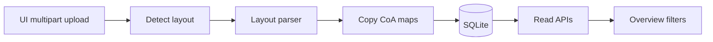

# Upload any country extract

## Current constraint

Ingest is CLI-only and bound to three adapters with fixed codes and filenames ([pipeline/adapters/country_a.py](pipeline/adapters/country_a.py), [country_b.py](pipeline/adapters/country_b.py), [country_c.py](pipeline/adapters/country_c.py)). `run_ingest()` in [pipeline/ingest.py](pipeline/ingest.py) always `reset_database()` and loads those three files from `data/`.

The UI never sees files. Country filters in [web/src/pages/transactions-page.tsx](web/src/pages/transactions-page.tsx) and [web/src/pages/mappings-page.tsx](web/src/pages/mappings-page.tsx) are hardcoded to CTA/CTB/CTC.

**Decision (confirmed):** the app only contains countries a user uploads. Sample files stay in `data/` so they can be uploaded by hand. `uv run python -m pipeline` will no longer populate A/B/C automatically.

CSV, XLSX, and JSON remain the supported formats — meaning the **three existing extract layouts**, not arbitrary spreadsheets:

- CSV like A: header includes `TXN_ID`, `ACCOUNT_CODE`, `AMOUNT_KES`, `DATE`
- Excel like B: sheets `Depenses` + `Plan_comptable`
- JSON like C: `{ metadata, transactions }` with `coaCode`

Unknown layouts are rejected with a clear error.

## Classification for a new country

Account maps in [mappings/account_map.csv](mappings/account_map.csv) are keyed by `country_code` (CTA/CTB/CTC). On upload, copy the matched layout’s map rows onto the new country’s code so uploading the sample files still classifies the same way. Keyword rules stay global.

## Architecture

## Backend

**1. Layout parsers, not country adapters**

- Keep the three parser modules; drop hardcoded `country_code` / `source_filename`.
- `load(path: Path, country_code: str) -> AdapterResult` (currency/language inferred from the layout or JSON `metadata.primaryCurrency`; Country A stays KES, B XOF, C from metadata).
- Add [pipeline/adapters/detect.py](pipeline/adapters/detect.py): extension + content fingerprint → layout id, or raise a structured error.

**2. Incremental ingest** (no full wipe on upload)

- Split persist logic out of `run_ingest()`: seed SHA/SRHR refs + keyword rules if missing; upsert `Country`; **replace** that country’s expenditures, accounts, maps, flags, and runs; leave other countries alone.
- On API startup (or first ingest), `create_all` so an empty `var/harmonized.db` works without a prior pipeline run.
- Stop seeding countries from [data/ref_countries.csv](data/ref_countries.csv).

**3. HTTP ingest**

New router, e.g. [api/routers/ingest.py](api/routers/ingest.py):

- `POST /api/ingest` (multipart): `file` (required), `country_name` (required), optional `country_code`.
- Sync handler (same as the rest of the API). Save under `var/uploads/`, detect, parse, persist.
- Response: country identity, detected format, record/flag counts.
- `GET /api/countries` for filter dropdowns (`country_code`, `country_name`).
- Generate a short unique code from the name when omitted (e.g. slug; suffix if collision). Re-upload of the same code replaces that country.

Reject unsupported extension/layout, empty file, and missing name with 400.

**4. CLI**

Change [pipeline/**main**.py](pipeline/__main__.py) to the same single-file path (`--file` + `--country-name`), not a 3-country rebuild. Update [README.md](README.md) ingest section.

## Frontend

- Overview ([web/src/pages/overview-page.tsx](web/src/pages/overview-page.tsx)): empty state with upload form (file + country name); after success, `mutate` SWR so cards appear. Drop “Countries A, B and C” copy.
- Use existing shadcn `Field` / `Input` / `Button` / `Empty` / `sonner` toast. Add `Dialog` only if the form would crowd a populated overview.
- Transactions and mappings: country options from `GET /api/countries` (or overview’s country list), not hardcoded CTA/CTB/CTC.
- Client: `uploadCountryExtract(formData)` in [web/src/lib/api.ts](web/src/lib/api.ts). Accept `.csv`, `.xlsx`, `.json`.

## Tests (required on both sides)

Backend (`uv run pytest`): add pytest (+ httpx) to `[project.optional-dependencies] dev`. In-memory SQLite per [backend-tests.mdc](.cursor/rules/backend-tests.mdc). Tiny fixtures that match each layout (not the 7,000-row extracts).

- Detect CSV / XLSX / JSON layouts; reject unknown
- `POST /api/ingest` creates a country and expenditures
- Second country coexists; re-upload same code replaces
- Empty overview / countries list before any upload

Frontend (`npm test` from `web/`): add Vitest + Testing Library per [frontend-tests.mdc](.cursor/rules/frontend-tests.mdc).

- Empty overview shows upload; success path calls ingest and shows the new country
- Unknown/failed upload surfaces an error
- Country filters render API-provided names, not hardcoded A/B/C
