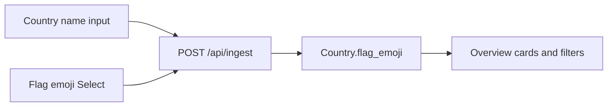

# Independent country name + flag emoji select

The upload form on [web/src/components/country-upload-form.tsx](web/src/components/country-upload-form.tsx) stays **file + free-text country name**. A new **Flag** Select lists **emojis only**. Name and flag are independent: “Kenya” can take 🇫🇷.

`feat/country-flag` already stores `flag_emoji` end-to-end, but it replaced the name field with an ISO country picker (`🇰🇪 Kenya`). Reuse that **storage/API** design on the current branch; do not reuse that picker.

## Upload form

In [web/src/components/country-upload-form.tsx](web/src/components/country-upload-form.tsx):

- Keep the existing `Country name` `Input`.
- Add a compact `Field` labeled **Flag** using the existing shadcn Select ([web/src/components/ui/select.tsx](web/src/components/ui/select.tsx)).
- Options come from a new [web/src/lib/countries.ts](web/src/lib/countries.ts): ISO 3166-1 alpha-2 → regional-indicator emoji (same catalog as `feat/country-flag`). Items **render the emoji only**. Put the ISO display name in `aria-label` / `sr-only` so the list is accessible and typeahead still finds 🇰🇪 when typing “Kenya”.
- Flag is optional. Empty selection omits `flag_emoji`.
- Submit both fields: `country_name` from the input, `flag_emoji` from the Select.

Widen the form grid so file, name, flag, and submit sit on one row on desktop (`md:grid-cols-[1fr_1fr_auto_auto]`).

## Persist and return the emoji

Reuse the `feat/country-flag` backend slice:

- Nullable `Country.flag_emoji` in [pipeline/models.py](pipeline/models.py).
- `ensure_schema()` in [pipeline/db.py](pipeline/db.py) adds the column on existing SQLite/Postgres DBs; call it from `init_database()`.
- `normalize_flag_emoji` + optional `flag_emoji` on `ingest_file` / `run_ingest` in [pipeline/ingest.py](pipeline/ingest.py). Re-upload without a flag **keeps** the existing emoji.
- Form field on [api/routers/ingest.py](api/routers/ingest.py); include `flag_emoji` on `CountryOut`, `CountrySummary`, `IngestOut` in [api/schemas.py](api/schemas.py).
- Overview summaries in [api/routers/overview.py](api/routers/overview.py).
- Optional CLI `--flag-emoji` on [pipeline/**main**.py](pipeline/__main__.py).

## Show the flag after ingest

- [web/src/types.ts](web/src/types.ts): add `flag_emoji: string | null` on country types.
- [web/src/lib/format.ts](web/src/lib/format.ts): `formatCountryLabel({ country_name, flag_emoji })` → `🇰🇪 Kenya`.
- Overview card title in [web/src/pages/overview-page.tsx](web/src/pages/overview-page.tsx).
- Country filter labels on [web/src/pages/transactions-page.tsx](web/src/pages/transactions-page.tsx) and [web/src/pages/mappings-page.tsx](web/src/pages/mappings-page.tsx).

## Tests

Backend (`uv run pytest`):

- Ingest stores `flag_emoji`; omit on re-upload keeps it; `/api/countries` and `/api/overview` return it.
- `ensure_schema` adds the column on a pre-existing `country` table ([tests/test_db.py](tests/test_db.py)).

Frontend (`npm test` in `web/`):

- Upload still types a free-text name; picking 🇰🇪 posts `flag_emoji`.
- Name and flag are independent (e.g. name “Kenya”, flag 🇫🇷).
- Overview / filter tests assert the formatted label when `flag_emoji` is present.

Verify in the browser: type a custom name, pick an unrelated flag, upload, confirm the card and country filters show that emoji beside the typed name.
