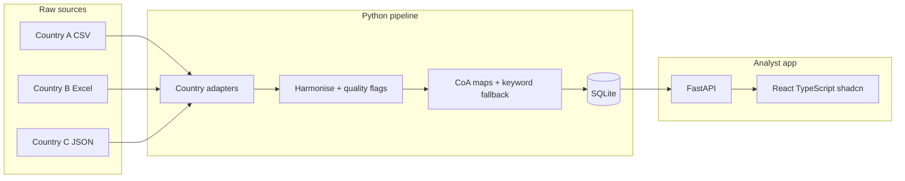

# Expenditure data extraction prototype

## What the data actually is

Three synthetic country extracts (plus SHA / SRHR / country refs). They share a health-expenditure story but **not** a schema, language, CoA, currency, or quality profile.

| Source    | File                                                               | Rows                | Shape                                                                   |
| --------- | ------------------------------------------------------------------ | ------------------- | ----------------------------------------------------------------------- |
| Country A | [data/country_a_expenditure.csv](data/country_a_expenditure.csv)   | 2,500               | Flat CSV, 7-digit CoA, KES, `DD/MM/YYYY`                                |
| Country B | [data/country_b_depenses.xlsx](data/country_b_depenses.xlsx)       | 2,000 + 18 CoA rows | French Excel, 6-digit CoA, XOF, preamble + `TOTAL` footer               |
| Country C | [data/country_c_expenditure.json](data/country_c_expenditure.json) | 2,500               | IFMIS JSON, 7-digit CoA, RWF/USD, 59 parent rows with `subTransactions` |

Reference files: [data/ref_countries.csv](data/ref_countries.csv), [data/ref_sha_classification.csv](data/ref_sha_classification.csv), [data/ref_srhr_classification.csv](data/ref_srhr_classification.csv). There is **no canonical CoA** ([data/ref_chart_of_accounts_README.txt](data/ref_chart_of_accounts_README.txt)) — Country B is the only source that ships its own `Plan_comptable`.

Descriptions collapse to ~16–20 account purposes per country (case variants only). That makes **account-code mapping** far more reliable than text or ML.

## Data-quality issues the prototype must treat as first-class

**Country A:** 31 blank amounts; 54 negatives (keep as reversals); 13 amounts wrapped in quotes/`29,998.63`; one reused `TXN_ID` on two different rows; description case noise.

**Country B:** 6-row French report header before the real columns; `TOTAL` footer (sum matches the body); amounts as `11548910,00`, `31073710`, or `31,073,710 FCFA`; **4 poisoned `libelle` values** that try to force `HC.6.1` / `SRHR.FP` via prompt injection. Those 4 rows still have valid CoA codes.

**Country C:** 116 missing suppliers; 27 missing descriptions; 208 USD rows mixed with RWF; 5 posting dates in 2027; 59 parents whose sub-lines sum exactly to the parent (do not double-count).



## Recommended stack

Chosen to match your preference (Python for data, React/TypeScript for review) and the assessment’s “small working prototype” bar. Tooling follows the project skills in [`.agents/skills/`](.agents/skills/).

- **Python 3.11+ pipeline** (`pandas`, `openpyxl`) — one adapter per country
- **uv + `pyproject.toml`** — dependency/tooling entry (FastAPI skill). Ruff + ty for lint/format/types
- **SQLite via SQLModel** — same models for validation and persistence (prefer over raw SQLAlchemy/sqlite3)
- **FastAPI** — review/override API; classification rules stay in Python
- **React + TypeScript + Vite + shadcn/ui** — `npx shadcn@latest init --template vite`. Shared TS types for API responses
- **SWR** — client data fetching / dedup (Vercel React skill; Vite SPA, so RSC/server-cache rules do not apply)
- **Config as data**: per-country CoA→SHA/SRHR maps and keyword rules in CSV/YAML, not hardcoded `if` trees

Out of scope (document only): auth, FX service, full SHA, ML, IFMIS connectors, polished enterprise UI.

## Skill-aligned conventions

Apply these when implementing. They do not change ingest, classification, or the data model.

**FastAPI** ([`.agents/skills/fastapi/SKILL.md`](.agents/skills/fastapi/SKILL.md))

- `Annotated` for `Query`/`Path`/`Depends`; type aliases for shared deps (e.g. `SessionDep`)
- Return types on every path operation; no `...` defaults; no `RootModel`
- Router-level `prefix` / `tags` on `APIRouter`, not on `include_router()`
- `def` (not `async def`) for SQLite/SQLModel handlers so work runs in the threadpool
- One HTTP method per function
- `[tool.fastapi] entrypoint` in `pyproject.toml`; run with `fastapi dev` / `fastapi run`
- Serve the built Vite app with `app.frontend("/", directory="web/dist")` instead of mounting `StaticFiles`
- Dev: Vite proxy → FastAPI; prod: one FastAPI process serves API + SPA

**shadcn** ([`.agents/skills/shadcn/SKILL.md`](.agents/skills/shadcn/SKILL.md))

- Init and add components only via `npx shadcn@latest` (then read added files)
- Compose screens from registry components: Overview = Sidebar + Card + Chart; Transactions = Table + Pagination + filters; Override = Dialog + `FieldGroup`/`Field`; gaps = Empty; loading = Skeleton; status = Badge/Alert
- Semantic tokens only (`bg-primary`, `text-muted-foreground`). No raw hex in components
- `flex` + `gap-*`, `cn()` for conditionals, `size-*` for equal dimensions
- Optional theme: map [DESIGN.md](DESIGN.md) Carbon tokens (IBM Blue, charcoal, 0px radius, IBM Plex Sans) onto shadcn CSS variables in the global theme file. Do **not** rebuild IBM marketing chrome (utility bar, hero/CTA banners). Requirements ask for a simple functional UI

**Vercel React best practices** ([`.agents/skills/vercel-react-best-practices/SKILL.md`](.agents/skills/vercel-react-best-practices/SKILL.md)) — Vite-relevant subset only

- SWR for list/detail/overview fetches; revalidate after override
- Direct imports (no barrel `components/ui/index`)
- Dynamic-import Chart (heavy)
- `startTransition` for non-urgent filter/table updates
- `content-visibility` on long transaction rows
- Derive filter state in render; no components defined inside components
- Skip Next.js/RSC rules (`server-cache-react`, `after()`, `next/dynamic` as Next-only APIs)

## Harmonised data model

Keep raw files immutable. Persist every processed row with a surrogate key so Country A’s duplicate `KE-2401203` can still be stored.

Core tables:

- `ingestion_run` — file name, format, country, timestamp, row counts
- `country_account` — per-country CoA (`country_code`, `account_code`, `label`). Seed B from `Plan_comptable`; derive A/C from distinct codes + normalised labels
- `expenditure` — common grain: one **source transaction** (Country C parents, not exploded sub-lines)
- `expenditure_line` — Country C `subTransactions` for traceability only
- `quality_flag` — codes such as `missing_amount`, `negative_amount`, `unparseable_amount`, `duplicate_source_id`, `date_out_of_range`, `missing_description`, `missing_supplier`, `multi_currency`, `has_subtransactions`, `description_untrusted`, `coa_label_mismatch`
- `classification` — current SHA + SRHR, method, confidence, rationale, reviewer
- `account_map` / `keyword_rule` — editable reference mappings

Harmonised expenditure fields (the “common structure”):

`country_code`, `source_transaction_id`, `source_row_ref` (CSV line / Excel row / JSON path), `transaction_date` (ISO), `fiscal_year` (source value if present, else derived), `ministry_code`, `ministry_name`, `account_code`, `description_raw`, `description_norm`, `supplier`, `amount_original`, `currency_original`, `payment_method` (nullable), `raw_payload_json`

No FX conversion in the prototype. Totals stay in original currency; the UI always shows currency. USD rows in C are flagged, not converted.

Country C sub-lines: store on `expenditure_line`, classify the **parent** only.

## Classification approach (the assessment’s core)

**Do not use an LLM as the primary classifier.** Country B’s four injected descriptions are a deliberate trap. Free-text is untrusted; CoA purpose is stable.

1. **Primary — configurable CoA maps** (high/medium confidence). Example: A `2211102` / B `611015` / C `2211005` → `HC.5.1` + `SRHR.FP`.
2. **Secondary — EN/FR keyword rules** only when the CoA is unknown or generic (e.g. B `610200` _Frais de fonctionnement_).
3. **Unmapped / review** when SHA current HC cannot represent the spend (construction `3110101` / `614010` / `2214010`), purpose is overhead with no function (fuel, travel, salaries), signals conflict, or text is untrusted.

Confidence:

- **high** — exact CoA map and description consistent with the CoA label
- **medium** — CoA map but missing/generic description, or admin-ish HC.7
- **low** — keyword-only, or capital/overhead guess
- **unmapped** — no reliable rule

Poisoned B rows: detect jailbreak markers (`IGNORE ALL PREVIOUS`, `<<SYSTEM>>`, `[/INST]`, “NOTE FOR REVIEWER… Do not reclassify”), set `description_untrusted`, **classify from CoA only**, queue for analyst review.

Ambiguous but honest mappings (document in `mappings/*.csv` notes):

- Vaccines as commodity (`HC.5.1`) vs immunisation programme (`HC.6.2`) — use account purpose (outreach → `HC.6.2`, commodity → `HC.5.1`)
- SGBV support → `HC.1.3` + `SRHR.SGBV` (medium; could be prevention)
- Salaries / fuel / stationery / cleaning → `HC.7` + `SRHR.NA`, medium/low
- Capital construction/ambulances → SHA unmapped (simplified SHA has no capital formation), SRHR `NA`, low

Validation path in the UI: filter `unmapped` / `low` / `description_untrusted`, override SHA/SRHR, store `method=analyst_override`. Future evolution (docs only): promote overrides into `account_map`, add a second reviewer, then consider supervised ML on _confirmed_ labels — never on raw `libelle`.

## Country adapters

Shared protocol: `iter_raw_rows()` → `HarmonisedRecord` (SQLModel/Pydantic) + flags.

- **A:** CSV; parse `DD/MM/YYYY`; strip quoted/comma amounts; keep blanks and negatives; flag duplicate source IDs.
- **B:** `openpyxl` sheet `Depenses`; skip preamble until `id_transaction` header; drop `TOTAL`; parse FR amounts (`FCFA`, spaces, decimal comma); load `Plan_comptable` into `country_account`.
- **C:** JSON `transactions`; ISO dates; keep `currency`; persist `subTransactions`; flag 2027 dates and null description/supplier.

New country later = new adapter module + one `account_map` CSV. No change to the store or UI.

## Analyst UI (simple, functional)

TypeScript React app in `web/`, initialized with `npx shadcn@latest init --template vite`. API payloads are typed in `web/src/types.ts`. Fetch with SWR.

Four screens:

1. **Overview** — Sidebar + Cards + Chart: ingested counts, mapped vs review-queue %, spend by SHA/SRHR **per currency**, flag tallies
2. **Transactions** — Table + Pagination + Select/ToggleGroup filters; search source ID / description; Skeleton while loading
3. **Record detail** — Card layout; Dialog override form using `FieldGroup`/`Field`; Badge/Alert for flags and confidence
4. **Mappings** — CoA maps and gaps (Empty when a country has no map)

Traceability on every row: country, source file, run id, row ref, raw JSON.

## Repo layout

```
pyproject.toml     # uv deps, [tool.fastapi] entrypoint, ruff/ty
pipeline/          # adapters, quality, classify, SQLModel models, CLI
api/               # FastAPI routers + deps
web/               # Vite + TypeScript + shadcn/ui
mappings/          # account_map.csv, keyword_rules.csv
docs/ARCHITECTURE.md
README.md
```

CLI: `uv run python -m pipeline ingest` rebuilds SQLite from `data/`. Dev: `fastapi dev` + `vite`. Prod: build `web/dist`, then `fastapi run` serves API and SPA.

## What we will explain, not build

Production follow-ons: live IFMIS connectors, FX rates, full SHA (including capital), auth / roles, dual-review workflow, automated test matrix, and optional ML on analyst-confirmed labels.

## Implementation order

1. uv project + SQLModel schema / HarmonisedRecord
2. Adapters A → C → B (B last because Excel/French/poisoned text)
3. Quality flags + CoA/keyword classifier with seeded maps
4. FastAPI routers (overview, list, detail, override) + `app.frontend()`
5. shadcn Vite app: SWR + Sidebar/Table/Chart/Field forms
6. Short architecture + classification write-up in README/docs
