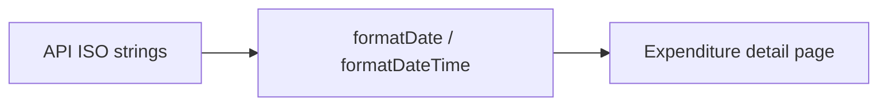

# Format transaction dates for display

The API already returns clean ISO values (`2024-03-15` for dates, `2024-03-15T14:32:01+00:00` for datetimes). The analyst UI prints them raw on the transaction detail page in [`web/src/pages/expenditure-page.tsx`](web/src/pages/expenditure-page.tsx):

- Harmonised **Date**: `data.transaction_date`
- Classification **classified_at**
- Lineage **ingested_at**

Amounts already go through `formatAmount` with `en-GB` in [`web/src/lib/format.ts`](web/src/lib/format.ts). Dates should follow the same locale.

## Why not a date library

Skip `date-fns` / Day.js / Luxon for this work. The API already hands over ISO strings; the UI only needs to print them. That is the same job `Intl.NumberFormat` already does for money, so `Intl.DateTimeFormat` stays consistent and adds no dependency.

A library would pay off later for relative time ("2 hours ago"), date pickers, ranges, or locale switching. None of that is in scope. The one real footgun — UTC midnight shifting a `YYYY-MM-DD` back a day — is a few lines in the helper, covered by tests.

## Display format

Add two helpers next to `formatAmount`:

- `formatDate` — `19 Sep 2026` (`day: "numeric"`, `month: "short"`, `year: "numeric"`)
- `formatDateTime` — `19 Sep 2026, 14:32` (same date plus hour/minute)

Null/empty → `"—"`. Unparseable strings fall back to the original value so analysts do not lose source text.

Parse `YYYY-MM-DD` as a **local calendar date** (`new Date(y, m - 1, d)`), not `new Date("2024-03-15")`, which is UTC midnight and can show the previous day in US timezones.

## Where to apply

Wire the helpers only where dates are already shown:

- [`web/src/pages/expenditure-page.tsx`](web/src/pages/expenditure-page.tsx) — `transaction_date`, `classified_at`, `ingested_at`

The transactions table has `transaction_date` in the payload but does not render it; this change does not add a column.

## Tests

UI-only; skip pytest.

- Extend [`web/src/lib/format.test.ts`](web/src/lib/format.test.ts) for date-only, datetime, null, and unparseable cases
- Add a focused [`web/src/pages/expenditure-page.test.tsx`](web/src/pages/expenditure-page.test.tsx) that mocks `/api/expenditures/:id` and asserts the analyst sees `19 Mar 2024` rather than `2024-03-19` / a raw ISO timestamp

Run `npm test` from `web/`.
