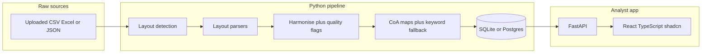

# Architecture and classification

## Why this prototype exists

Countries send expenditure extracts that differ in format, language, chart of accounts, currency, and data quality. The organisation needs a repeatable way to ingest those files, store a common record, classify against SHA and SRHR, and let an analyst review uncertain rows.

This prototype demonstrates that path for uploaded extracts in three known layouts. It is not an IFMIS integration and not a full System of Health Accounts implementation.

## Components

| Piece | Role |
| --- | --- |
| `pipeline/adapters/` | Layout detection, then one parser per extract layout (CSV / Excel / JSON). Each emits `HarmonisedRecord` plus quality flags. |
| `pipeline/quality.py` | Text normalisation, date bounds, jailbreak-marker detection. |
| `pipeline/classify.py` | CoA-first classifier with keyword fallback. |
| `mappings/*.csv` | Editable rules. Uploaded countries inherit the matched layout’s CoA map slice. |
| `pipeline/db.py` | Default SQLite at `var/harmonized.db`; Postgres when `DATABASE_URL` or `POSTGRES_URL` is set. `VAR_DIR` holds uploads and the SQLite file (process temp on Vercel). |
| `pipeline/models.py` | Lineage, flags, current and historical classifications, optional `country.flag_emoji` (display only). |
| `api/` | Overview, expenditures (list / detail / override), mappings, countries, `POST /api/ingest`. Sync handlers because SQLModel sessions are blocking. |
| `web/` | Analyst UI. Vite proxies `/api` in development. FastAPI `app.frontend()` serves `web/dist` in production. |

Upload a country extract in one of the three layouts. The store and UI stay the same. Re-uploading a country replaces its records.

### Analyst UI

| Route | Role |
| --- | --- |
| `/` | Overview: upload (optional flag), ingest counts, review-queue share, spend by currency, SHA / SRHR / flags. |
| `/transactions` | Filterable list (country, confidence, SRHR, quality flag, search). |
| `/transactions?review_only=1` | Review queue: `low` / `unmapped` / `description_untrusted`. |
| `/transactions/:id` | Record detail, lineage, flags, analyst override. |
| `/mappings` | Per-country CoA maps and gaps. |

## Harmonised grain

One `expenditure` row is one **source transaction**. Country C `subTransactions` are stored on `expenditure_line` for lineage and are not classified separately, so parent amounts are not double-counted.

Surrogate `expenditure.id` is the primary key. Country A reuses `KE-2401203` on two different rows; both are kept and flagged `duplicate_source_id`.

Amounts stay in the source currency. USD rows in Country C are flagged `multi_currency`. There is no FX conversion in this prototype.

## Classification approach

### Why not an LLM or a trained model

Country B includes four `libelle` values that attempt prompt injection (`IGNORE ALL PREVIOUS INSTRUCTIONS`, `<<SYSTEM>>`, `[/INST]`, a fake reviewer note forcing `SRHR.FP`). Those rows still have valid budget codes on `Plan_comptable`.

Free text is therefore treated as untrusted evidence. Chart-of-account purpose is stable across case noise, missing descriptions, and adversarial strings. A sophisticated model is also out of scope for the allotted time.

### How it works

1. **Primary: configurable CoA maps** in `mappings/account_map.csv`. Example: CTA `2211102`, CTB `611015`, CTC `2211005` → `HC.5.1` + `SRHR.FP`.
2. **Secondary: EN/FR keyword rules** in `mappings/keyword_rules.csv`, used only when the CoA is unknown or marked `generic` (CTB `610200` operating expenses) **and** the description is trusted.
3. **Unmapped / review** when simplified SHA cannot represent the spend (capital construction and ambulance purchases), when purpose is unspecified overhead, or when text is untrusted.

Confidence:

- **high** — exact CoA map and consistent, trusted description
- **medium** — CoA map with missing description, administration (`HC.7`), or untrusted text (high maps are downgraded)
- **low** — keyword-only, or weakly specified overhead (fuel, travel)
- **unmapped** — no SHA code assigned (capital out of the supplied SHA list)

Poisoned Country B rows are flagged `description_untrusted` (and usually `coa_label_mismatch`). Classification uses the CoA map only. The injected `HC.6.1` / `SRHR.FP` instructions are ignored.

### Assumptions

- Account codes in these extracts are 1:1 with a spend purpose. That is true in the sample; it will not always be true in operational IFMIS data.
- Ministry is not used as a classifier. Health-related spend appears in education, finance, interior, and family-affairs ministries.
- Vendors are not used. Synthetic vendors often contradict the description.
- Salaries, fuel, cleaning, stationery, and travel are coded `HC.7` + `SRHR.NA` unless a more specific CoA exists.
- Vaccine **commodities** are `HC.5.1`; immunisation **outreach programmes** are `HC.6.2`.
- SGBV survivor support is `HC.1.3` + `SRHR.SGBV` (medium; it could be prevention).
- The supplied SHA list has no capital-formation codes, so construction and ambulance *purchases* are SHA-unmapped.

### Uncertainty and validation

Records enter the review queue when confidence is `low` or `unmapped`, or when `description_untrusted` is set. An analyst can override SHA and SRHR; the previous row is retained with `is_current=false` and the new row is `method=analyst_override`.

### How the approach could evolve

1. Promote confirmed overrides into `account_map.csv`.
2. Add a second reviewer for high-value or unmapped capital.
3. Split generic operating accounts using programme or project codes, if countries can supply them.
4. Add FX rates as a separate reference, never by rewriting source amounts.
5. Only then consider supervised methods, and only on **analyst-confirmed** labels — never on raw `libelle`.

## Data-quality handling

| Issue | Handling |
| --- | --- |
| Blank amounts (A) | Keep the row, flag `missing_amount`, exclude from totals |
| Quoted/comma amounts (A) | Parse after stripping quotes and thousands separators |
| French amounts (`31,073,710 FCFA`, `11548910,00`) (B) | Dedicated parser |
| Negatives (A) | Keep as reversals, flag `negative_amount` |
| Duplicate source IDs (A) | Keep both, flag |
| Excel preamble and `TOTAL` footer (B) | Skip |
| Official CoA sheet (B) | Load into `country_account` |
| Missing description/supplier (C) | Flag; still classify from CoA |
| Dates in 2027 (C) | Flag `date_out_of_range` |
| Sub-transactions (C) | Lineage only |
| Prompt injection (B) | `description_untrusted`; classify from CoA |

## Out of scope (explain, do not build)

Live IFMIS connectors, enterprise authentication, FX services, full SHA (including capital), dual-review workflow, a machine-learning platform, and a polished enterprise UI.
