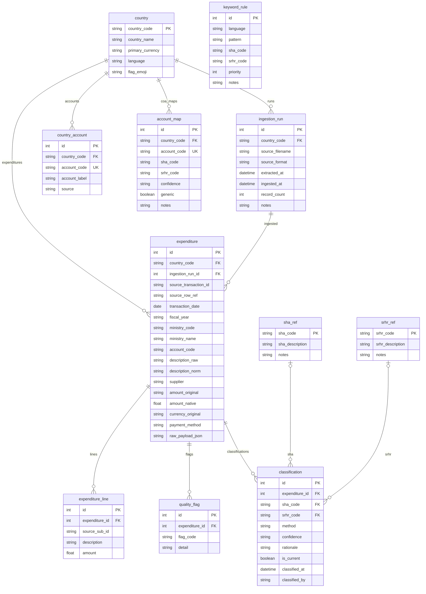

```mermaid
erDiagram
    country ||--o{ ingestion_run : runs
    country ||--o{ country_account : accounts
    country ||--o{ expenditure : expenditures
    country ||--o{ account_map : coa_maps
    ingestion_run ||--o{ expenditure : ingested
    expenditure ||--o{ expenditure_line : lines
    expenditure ||--o{ quality_flag : flags
    expenditure ||--o{ classification : classifications
    sha_ref |o--o{ classification : sha
    srhr_ref |o--o{ classification : srhr

    country {
        string country_code PK
        string country_name
        string primary_currency
        string language
        string flag_emoji
    }

    sha_ref {
        string sha_code PK
        string sha_description
        string notes
    }

    srhr_ref {
        string srhr_code PK
        string srhr_description
        string notes
    }

    ingestion_run {
        int id PK
        string country_code FK
        string source_filename
        string source_format
        datetime extracted_at
        datetime ingested_at
        int record_count
        string notes
    }

    country_account {
        int id PK
        string country_code FK
        string account_code UK
        string account_label
        string source
    }

    expenditure {
        int id PK
        string country_code FK
        int ingestion_run_id FK
        string source_transaction_id
        string source_row_ref
        date transaction_date
        string fiscal_year
        string ministry_code
        string ministry_name
        string account_code
        string description_raw
        string description_norm
        string supplier
        string amount_original
        float amount_native
        string currency_original
        string payment_method
        string raw_payload_json
    }

    expenditure_line {
        int id PK
        int expenditure_id FK
        string source_sub_id
        string description
        float amount
    }

    quality_flag {
        int id PK
        int expenditure_id FK
        string flag_code
        string detail
    }

    classification {
        int id PK
        int expenditure_id FK
        string sha_code FK
        string srhr_code FK
        string method
        string confidence
        string rationale
        boolean is_current
        datetime classified_at
        string classified_by
    }

    account_map {
        int id PK
        string country_code FK
        string account_code UK
        string sha_code
        string srhr_code
        string confidence
        boolean generic
        string notes
    }

    keyword_rule {
        int id PK
        string language
        string pattern
        string sha_code
        string srhr_code
        int priority
        string notes
    }
```